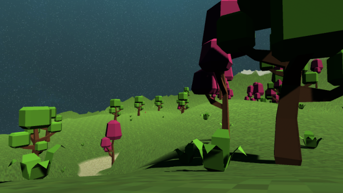

# Spaceworks #

Spaceworks is a work-in-progress collection of C# classes for the Unity3D Game Engine which allows the programmer to create Planetary Game Terrain.

## Project Structure ##
1. Materials
	* Preconfigured test materials
2. Primitives
	* C# classes that are utilized by each of the systems within Spaceworks
3. Scenes
	* Test scenes for each system
4. Shaders
	* Premade shaders
5. Systems
	* C# scripts relating to various parts of Spaceworks

## Systems ##
The core system to Spaceworks is the Planet Render which creates, manages, and renderes planetary terrain. This is usually done through the Planet Service script. There are many auxilary systems which are used alongside the planet renderer. These include a modular building system, a random planet name generator, a floating origin system for large sized scene management, and some basic camera scripts.

## How To Install ##
Simply download the source code from this GIT repository and import it anywhere in the Assets folder of an existsting Unity3D project.

## How To Use ##
At the moment, the method to use this system is a little unintuitive. 
1. Create a new GameObject in your scene and add a **PlanetService** script to this GameObject.
	* The planet service contains configuration setting for the planet as well as manages the levels of detail based off the main camera position.
2. There are several references that must be assigned in the **PlanetService** or your game will throw errors when you try to run it
	1. Material (Required)
		* Planets require a material to appear textured. You may use any material including the default material. 
		* A planet material is included in the Spaceworks "Materials" folder.
	2. Generation Service (Required)
		* This service creates the mesh geometry for a planet given a node in the Quadtree-LOD
		* Several Generation Services are included in Spaceworks
			1. **CpuMeshGenerator** - Creates meshes procedurally on the CPU using Perlin noise
			2. **CubemapMeshGenerator** - Creates meshes by sampling a 6 sided cubemap representing the height of the terrain
			3. **SphereMeshGenerator** - Creates meshes as a simple sphere with no roughness
		* You can create your own Generation Service by creating a new class that extends **IMeshService**
	3. Texture Service (Optional)
		* The Texture Serivce configures the supplied material
		* Texture Services initialize the material's parameters and update parameters if the planet is moved
		* Only one default Texture Service is provided for the Spaceworks "Planet Shader"
		* You can create your own Texture Service by creating a class that extends **ITextureService**
	4. Detail Service (Optional)
		* Detail services spawns GameObjects on a planet's surface when the surface area reaches maximum detail in the LOD system
		* The **ProceduralObjectPlacer** is the only Detail Service provided
		* You can create your own Detail Service by extending the **IDetailer** class 
3. Configure all the settings 
4. Optionally, add a **FloatingOrigin** script to your scene and set the Foci to the main camera. 
	* This enables the planet to use a floating origin solution for positioning in order to keep maxmimum possible floating point precision around the main camera. This is achieved by moving the whole world when the camera gets too far from the origin (0,0,0).